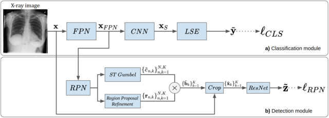
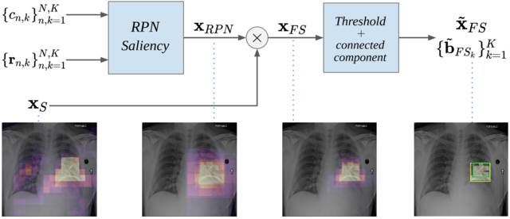

# RpSalWeaklyDet
Code for paper: ["Region Proposals for Saliency Map Refinement for Weakly-supervised Disease Localisation and Classification"](https://link.springer.com/chapter/10.1007/978-3-030-59725-2_52)
[[arxiv]](https://arxiv.org/abs/2005.10550).

## Model architecture


## Inference


## Install
`pip install git+https://github.com/renato145/RpSalWeaklyDet.git`

## Trained models
https://drive.google.com/file/d/1KVAZnwnTwiESg7FPmNCwmbpeGgkn9eqG/view?usp=sharing

## Citation

Please use the following bibtex entry:
```bibtex
@inproceedings{hermoza2020region,
  title={Region Proposals for Saliency Map Refinement for Weakly-Supervised Disease Localisation and Classification},
  author={Hermoza, Renato and Maicas, Gabriel and Nascimento, Jacinto C and Carneiro, Gustavo},
  booktitle={International Conference on Medical Image Computing and Computer-Assisted Intervention},
  pages={539--549},
  year={2020},
  organization={Springer}
}
```
